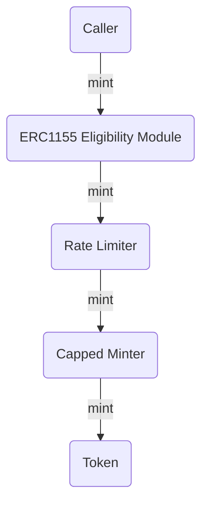

# Minter Mods

Minter mods are composable contracts that can plug into tokens to enforce custom mint rules without touching the core token logic. Some examples of custom mint rules include access control based on ERC-1155 ownership, daily or periodic rate limits, and capping the total mint amount.


## Composability & Extensibility

_Note: The Capped Minter is a special layer that sits directly in front of the core token to enforce your hard total-supply ceiling. All other mods chain on top of it._

ZkMinter extensions are designed to be chain multiple mods on the same token or even on top of each other to enforce sequential rules. For example:

1. **Capped Minter** enforces a hard total-supply ceiling. Always placed in front of the token before chaining on other minter mods.
2. **Rate Limiter** sits above the capped minter to throttle daily mint volumes.
3. **Eligibility Check** (ERC-1155 or custom) wraps the rate‐limited minter to gate minting based on external balance.

Under the hood each mod implements `IMintable` and points its `mintable` address at the next layer down (or the core token). This lets you mix-and-match minter mods.



## Why build a new mod?

Every project has unique minting requirements—time-windows, on-chain proofs, fee splits, identity checks, supply curves. By building your own `ZkMinterV1` extension you get:

- A standardized, audit-friendly scaffold with roles, pause/close, and event emission.
- Plug-and-play composability with existing mods.
- Easy customization within a standard framework.

# Roles & Controls

Every ZkMinterV1 extension ships with a set of built-in roles and lifecycle actions you can rely on:

### Roles

• **`DEFAULT_ADMIN_ROLE`**
– The admin of the module. Can grant/revoke roles, update parameters, update the `mintable` address, and perform permanent shutdowns by calling `close()`.
– Typical actors: DAO treasury or core team multisig.

• **`MINTER_ROLE`**
– Addresses granted this role are authorized to call `mint()` when the contract is neither paused nor closed.
– Typical actors: trusted dApp component, auction contract, vesting scheduler.

• **`PAUSER_ROLE`**
– Addresses granted this role can call `pause()` / `unpause()`, halting minting in emergencies or during upgrades without losing state.
– Typical actors: security engineer, devops on-call.

### Controls

• **`function pause()`**
– Temporarily blocks further mint calls while preserving on-chain counters, caps, and configuration.
– Use cases: emergency response to a bug, network congestion, or planned upgrades.

• **`function unpause()`**
– Re-enables minting after a pause, restoring all mint calls without altering state.
– Use cases: resume operations once an emergency patch is deployed or planned maintenance completes.

• **`function close()`**
– Permanently sets `closed = true` and emits `Closed(address closer)`. All future mints will revert.
– Use cases: project sunset, cap enforcement after full distribution, permanent compliance lock-down.

• **`function updateMintable(IMintable)`**
– Swaps the downstream `mintable` address so future `mint(...)` calls forward to a new contract.
– Use cases: upgrade your mint logic, replace the token contract, or re-layer mods without redeploying.

# Constructing a Minter Mod Contract

When building a new minter mod, you simply inherit from the `ZkMinterV1` contract. The base contract provides all of the required roles, pause/close logic, mintable-target management, events and error handling. All you have to do is:

1. Declare your global states (e.g. caps, thresholds, rate limits, delays, etc.)
2. In your constructor, set your `mintable` address, a token or another minter mod, using `_updateMintable`. Grant `DEFAULT_ADMIN_ROLE` and `PAUSER_ROLE` to your initial admin by calling the `_grantRole` function. And initialize other params that are relevant to your minter mod custom logic.
3. Implement the `mint(address,uint256)` function to enforce your policy, make sure to call `mintable.mint(address,uint256)` and emit `Minted`.
4. Add any setters (e.g. `updateCap`, `updateThreshold`, etc.) guarded by `DEFAULT_ADMIN_ROLE` and emit custom events if needed.

# Contributing Guidelines

Whether you’re building your own ZkMinter extension or improving the core repo, please follow these norms and procedures to keep our codebase consistent, secure, and review‐ready.

#### 1. Workflow & Branching

- Fork the main repo and clone your fork.
- Create a descriptive branch off main (or dev):
  feat/<short-description>
  fix/<short-description>
- Keep branches focused—one logical change per branch/PR.

#### 2. Development & Testing

- Use Solidity 0.8.24 and OpenZeppelin contract version consistent with the repo.
- Install dependencies and run tests locally before pushing:

```
npm install
npm run lint
npm run test
```

- Write unit tests for every new function, including edge and failure cases.

#### 3. Code Style & Documentation

- Follow the repository’s linter and formatter rules
- Add NatSpec comments (/// @notice, @dev) for all functions, variables, events, and errors.
- Keep functions small, clearly named, and with a single responsibility.
- Emit events for any state change (settings updates, cap changes, etc.).

#### 4. PR Checklist

Before requesting review, ensure you have:

- [ ] Pulled the latest `main` branch and rebased your branch.
- [ ] All tests passing and lint errors fixed.
- [ ] NatSpec comments on any new or modified functions, variables, events, and errors.
- [ ] A clear PR title and description explaining what you’ve done and why.

# ZkMinterV1

### Inheritance

`ZkMinterV1` inherits from:

- `IMintable` – defines the `mint(address,uint256)` interface.
- `AccessControl`– OZ role-based permissions (`DEFAULT_ADMIN_ROLE`, `MINTER_ROLE`, etc.).
- `Pausable` – OZ pause/unpause functionality.

### FUNCTIONS

| Function Signature                                        |
| --------------------------------------------------------- |
| [`pause()`](#pause)                                       |
| [`unpause()`](#unpause)                                   |
| [`close()`](#close)                                       |
| [`updateMintable(IMintable)`](#_updateMintableIMintable)  |
| [`_updateMintable(IMintable)`](#_updateMintableIMintable) |
| [`_revertIfClosed()`](#_revertifclosed)                   |

## EVENTS

| Event Signature                                                                                                                                                          |
| ------------------------------------------------------------------------------------------------------------------------------------------------------------------------ |
| [`Closed(address closer)`](#Closedaddress)                                                                                                                               |
| [`Minted(address indexed minter, address indexed to, uint256 amount)`](#Mintedaddress-indexed-minter-address-indexed-to-uint256-amount)                                  |
| [`MintableUpdated(IMintable indexed previousMintable, IMintable indexed newMintable)`](#MintableUpdatedIMintable-indexed-previousMintable-IMintable-indexed-newMintable) |

## ERRORS

| Error Signature                                           |
| --------------------------------------------------------- |
| [`ZkMinter__ContractClosed()`](#ZkMinter__ContractClosed) |

### pause()

Pauses all minting operations.

- Caller must have the `PAUSER_ROLE`.
- Invokes OZ’s `_pause()` to block further `mint()` calls until `unpause()` is called.

### unpause()

Resumes minting after a pause.

- Caller must have the `PAUSER_ROLE`.
- Invokes OZ’s `_unpause()` so `mint()` can be called again.

### close()

Permanently disables all future minting.

- Caller must have the `DEFAULT_ADMIN_ROLE`.
- Sets `closed = true` and emits the [`Closed(address closer)`](#closedaddress-closer) event.

### updateMintable(IMintable)

Updates the `mintable` address — a token or another minter mod contract.

- Caller must have the `DEFAULT_ADMIN_ROLE`.
- Calls internal `_updateMintable` and emits [`MintableUpdated(previous, new)`](#mintableupdatedimintable-indexed-previousmintable-imintable-indexed-newmintable).

### \_updateMintable(IMintable)

Internal helper that updates the `mintable` address.

- Emits the [`MintableUpdated`](#mintableupdatedimintable-indexed-previousmintable-imintable-indexed-newmintable) event with old and new targets.

### \_revertIfClosed()

Reverts the call if the contract has been permanently closed.

- Throws [`ZkMinter__ContractClosed()`](#zkminter__contractclosed) if `closed == true`.

### Closed(address)

Emitted when `close()` is called successfully.

- `address`: the admin who performed the permanent shutdown.

### Minted(address indexed minter, address indexed to, uint256 amount)

Emitted after any successful `mint()`.

- `minter`: the caller holding `MINTER_ROLE`.
- `to`: recipient of the newly minted tokens.
- `amount`: number of tokens minted.

### MintableUpdated(IMintable indexed previousMintable, IMintable indexed newMintable)

Emitted when the target `mintable` contract is changed via `updateMintable`.

- `previousMintable`: the old mintable contract.
- `newMintable`: the new mintable contract.

### ZkMinter\_\_ContractClosed()

Thrown by `_revertIfClosed()` to halt execution once the mod is `closed`.

- Guards every mint path to ensure no tokens are ever minted after a permanent shutdown.

# IMintable

### FUNCTIONS

| Function Signature                            |
| --------------------------------------------- |
| [mint(address \_to, uint256 \_amount)](#mint) |

### mint(address \_to, uint256 \_amount)

– Mint `_amount` tokens to the account `_to`.
– Must be implemented by any contract conforming to `IMintable`.
